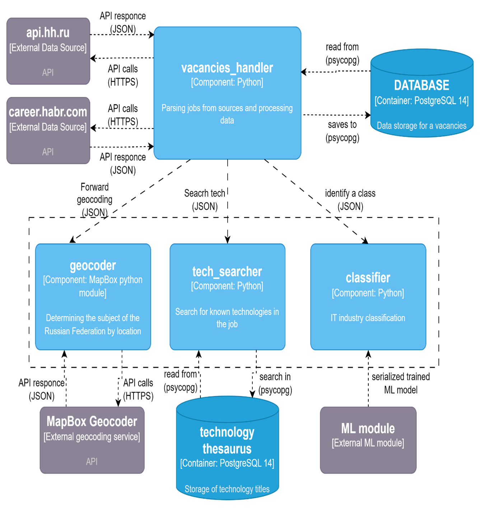
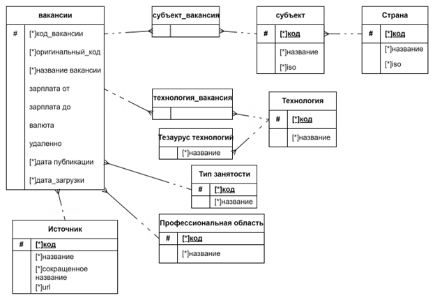

# Агрегатор вакансий

Агрегирует вакансии с habr и hh.ru.

Собирает и сохраняет следующие данные в json:
- source - источник
- id - идентификатор вакансии в источнике
- name - название вакансий
- salary_from - нижняя граница з/п
- salary_to - верхняя граница з/п
- currency - валюта
- date_publication - дата публикации на источнике
- location - ISO3166-2 код региона вакансии
- employment - тип занятости
- remote - удаленная работа (bool)
- skill - id-технологии в тезаурусе (с++, с#, 1С Предприятие и т.д.)
- description - краткое описание вакансии
- class - область вакансии (Пока только devs, qa, analytics)

Общая схема системы:

- Внешние источники
    - Хабр карьера
    - Headhunter.ru
- База данных -  PostgreSQL 14
- Основные элементы
    - vacancies_handler - отвечает за получение, препроцессинг данных, связь с дополнительными компонентами и загрузку в БД
    - geocoder - связывается с API MapBox для определения ISO3166-2 кода субъекта по записанному адресу в вакансии
    - tech_searcher - поиск ключевых слов в базе данных с помощью средств нечеткого полнотекстового поиска PostgreSQL
    - classifier - определение класса (devs, analytics, qa) вакансии с помощью Байесовской классификации

Инфологическая модель базы данных:

### TODO - лист
1. Выделить сериализованную ml-модель в отдельный проект и соединить с основным в качестве API
2. Отделить логику препроцессинга из пары модулей в класс препроцессора
3. Добавить интерфейсную часть и переработать способ хранения источников (перестать хранить в модуле sources.py)

[[Документация API hh.ru]](https://github.com/hhru/api)
[[Документация API habr career]](https://career.habr.com/info/api)
